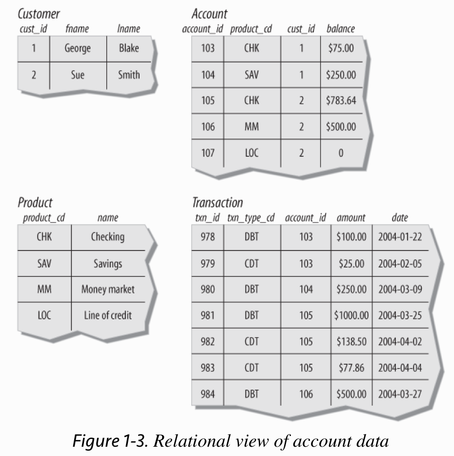
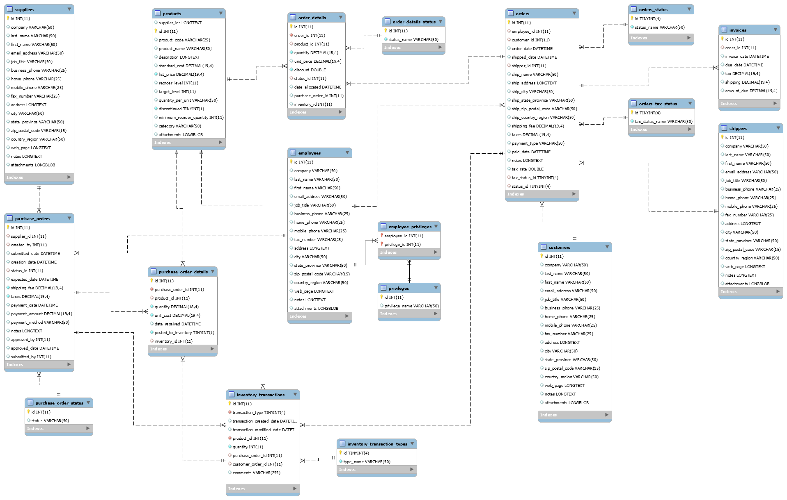

# SQL-Practice

I have created this repository to work on my SQL skills and brush up the basics of Data Engineering before I join my new team. 

**A database is nothing more than a set of related information.** Because of the cumbersome nature of paper databases, some of the first computer applications developed were database systems, which are computerized data storage and retrieval mechanisms. Because a database system stores data electronically rather than on paper, a database system is able to retrieve data more quickly, index data in multiple ways, and deliver up-to-the-minute information to its user community. Early database systems managed data stored on magnetic tapes. Because there were generally far more tapes than tape readers, technicians were tasked with loading and unloading tapes as specific data was requested. Because the computers of that era had very little memory, multiple requests for the same data generally required the data to be read from the tape multiple times. While these database systems were a significant improvement over paper databases, they are a far cry from what is possible with today’s technology. Modern database systems can manage petabytes of data, accessed by clusters of servers each caching tens of gigabytes of that data in high-speed memory. 

## The Relational Model

Over the first several decades of computerized database systems, data was stored and represented to users in various ways. In a hierarchical database system, for example, data is represented as one or more tree structures. Another common approach, called the network database system, exposes sets of records and sets of links that define relationships between different records. Both hierarchical and network database systems are alive and well today, although generally in the mainframe world. Additionally, hierarchical database systems have enjoyed a rebirth in the directory services realm, such as Microsoft’s Active Directory and the open-source Apache Directory Server. Beginning in the 1970s, however, a new way of representing data began to take root, one that was more rigorous yet easy to understand and implement. In 1970, Dr. E. F. Codd of IBM’s research laboratory published a paper titled “A Relational Model of Data for Large Shared Data Banks” that proposed that data be represented as sets of tables. Rather than using pointers to navigate between related entities, redundant data is used to link records in different tables. 

The number of columns that a table may contain differs from server to server, but it is generally large enough not to be an issue (Microsoft SQL Server, for example, allows up to 1,024 columns per table). The number of rows that a table may contain is more a matter of physical limits (i.e., how much disk drive space is available) and maintainability (i.e., how large a table can get before it becomes difficult to work with) than of database server limitations. Each table in a relational database includes information that uniquely identifies a row in that table (known as the primary key), along with additional information needed to describe the entity completely.

## What is SQL

Along with Codd’s definition of the relational model, he proposed a language called DSL/Alpha for manipulating the data in relational tables. Shortly after Codd’s paper was released, IBM commissioned a group to build a prototype based on Codd’s ideas. This group created a simplified version of DSL/Alpha that they called SQUARE. Refinements to SQUARE led to a language called SEQUEL, which was, finally, renamed SQL. SQL is now entering middle age (as is this author, alas), and it has undergone a great deal of change along the way. In the mid-1980s, the American National Standards Institute (ANSI) began working on the first standard for the SQL language, which was published in 1986. Subsequent refinements led to new releases of the SQL standard in 1989, 1992, 1999, 2003, and 2006. Along with refinements to the core language, new features have been added to the SQL language to incorporate object-oriented functionality, among other things. The latest standard, SQL:2006, focuses on the integration of SQL and XML and defines a language called XQuery which is used to query data in XML documents. 

SQL statements define the necessary inputs and outputs, but the manner in which a statement is executed is left to a component of your database engine known as the optimizer. The optimizer’s job is to look at your SQL statements and, taking into account how your tables are configured and what indexes are available, decide the most efficient execution path. Most database engines will allow you to influence the optimizer’s decisions by specifying optimizer hints, such as suggesting that a particular index be used etc. If you are using a non-database-specific language such as Java, however, you will need to use a toolkit/API to execute SQL statements from your code. Some of these toolkits are provided by your database vendor, whereas others are created by third-party vendors or by open source providers.

| Language     | Toolkit              						  | 
|--------------|----------------------------------------------|
| Java 	   	   | JDBC   		      						  |
| C++          | RogueWave Source Pro                         | 
| C/C++ 	   | Pro*C, MySQL C API, DB2 Call Level Interface |
| C#	 	   | ADO.NET   			  						  | 
| PERL   	   | PERL DBI   			  					  | 
| Python	   | Python DB   			  					  | 
| Visual Basic | ADO.NET   			 						  |

**If you only need to execute SQL commands interactively, every database vendor provides at least a simple command-line tool for submitting SQL commands to the database engine and inspecting the results**. Most vendors provide a graphical tool as well that includes one window showing your SQL commands and another window showing the results from your SQL commands. 

## Setting up MySQL Database

MyWind is a MySQL version of the Microsoft Access 2010 Northwind sample database which is quite popular for practicing SQL queries and it is also referenced in the [book](https://sqlpracticeproblems.com/) that I am currently using for practice. Note that the Mywind data is slightly different from the Northwind data, but the schema and all is the same.

These are instructions on how to set it up:

1. Login to MYSQL
	
		mysql -u root -p

2. Create our Database 
	 	
		CREATE DATABASE NORTHWIND;

3. Exit mysql tool and populate the Schema

		mysql -u root -p northwind < northwind.sql

2. Populate the Data

		mysql -u root -p northwind < northwind-data.sql

In general, all the popular database servers have the capacity to store the same types of data, such as strings, dates, and numbers. Where they typically differ is in the specialty data types, such as XML documents or very large text or binary documents.

## References

"Learning SQL" by Alan Beaulieu 

"SQL Practice Problems" by Sylvia Moestl Vasilik.

[MyWind Sample Database](https://github.com/dalers/mywind)

